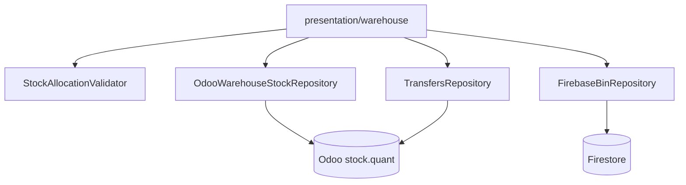

# Arquitectura — Gestión Almacén

## Objetivo

1. El usuario elige la **bodega de trabajo** (ubicación interna Odoo / clave primaria como hoy en transferencias).
2. Consulta **stock Odoo** por producto en esa bodega.
3. Asigna cantidades a **ubicaciones Firebase** (pasillos, racks, bins).
4. Valida que `Σ Firebase ≤ Odoo`.
5. Desde el mismo módulo accede a **movimientos internos** (pantallas de `features/transfers`).

## Diagrama

## Rutas (go_router)

| Ruta | Pantalla |
|------|----------|
| `/warehouse` | Inicio módulo, selección bodega |
| `/warehouse/stock` | Consulta stock + grillas Firebase |
| `/warehouse/transfers` | Enlace al flujo de transferencias |

## Reutilización

- **Odoo**: `TransfersRepository.fetchInternalLocations`, `fetchAvailableQuantityAtLocation`, `checkStockAtPrimaryOrigin`, `createInternalTransfer`.
- **Resolver ubicación**: `PrimaryOriginResolver` (misma lógica por empresa).
- **Firebase**: solo metadatos de ubicación interna y cantidades asignadas; no reemplaza quants de Odoo.

## Servicio de stock combinado

`WarehouseStockService.getProductSummary()`:

1. Lee `odooAvailable` desde Odoo.
2. Lee `allocations` desde Firebase filtradas por `warehouseKey` + `productId`.
3. Calcula `allocatedTotal`, `unallocated` = odoo - allocated.
4. Devuelve errores de validación si allocated > odoo.
